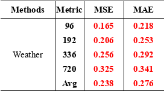
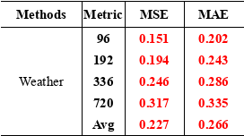
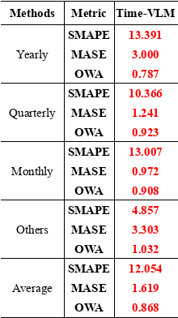
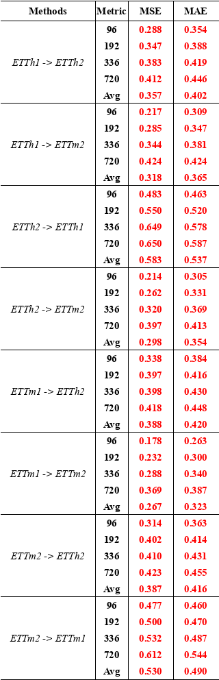

# Time-VLM 论文复刻项目

本仓库用于复刻 ICML 2025 论文 **Time-VLM: Exploring Multimodal Vision-Language Models for Augmented Time Series Forecasting**。原论文提出将时间序列、视觉表示和文本提示统一到预训练 Vision-Language Model 中，核心模块包括 Retrieval-Augmented Learner（RAL）、Vision-Augmented Learner（VAL）和 Text-Augmented Learner（TAL）。

论文链接：[arXiv](https://arxiv.org/abs/2502.04395) / [PMLR](https://proceedings.mlr.press/v267/zhong25a.html) / [OpenReview PDF](https://openreview.net/pdf?id=b5h60xQnzM)

## 项目目的

本项目不是重新提出新模型，而是围绕原论文做一套可检查、可导出、可对表的复刻流程：

- 复刻 Time-VLM 在 Weather、M4 和 ETT transfer 场景中的关键实验。
- 将训练过程和最终指标接入 Weights & Biases，方便后续整理 MSE、MAE、SMAPE、MASE、OWA。
- 生成接近论文格式的表格图，便于直接和原论文表格逐项比较。
- 标记未完成或需要重跑的实验，避免把不完整 run 当作复刻结论。

## 当前复刻范围

| 任务 | 原论文位置 | 当前状态 |
|---|---|---|
| Weather 5% few-shot | Table 1 / Appendix Table 12 | 已完成 |
| Weather 10% few-shot | Table 2 / Appendix Table 13 | 已完成 |
| Weather long-term 100% | Appendix Table 16 | 已完成 |
| M4 short-term | Appendix Table 15 | 已完成 |
| Zero-shot transfer | Table 3 / Appendix Table 14 | 已完成 |
| Weather ablation | Table 6 | 待基于修正后的消融逻辑重跑，当前不纳入结论 |

## 实验设置摘要

当前已纳入 README 的复刻结果主要来自 Weather 和 M4：

- Weather: `seq_len=512`，`pred_len={96,192,336,720}`，`periodicity=144`，`features=M`。
- M4: 使用 short-term forecasting 协议，指标为 SMAPE、MASE、OWA。
- 优化设置参考论文 Appendix A：`batch_size=32`，`learning_rate=0.001`，`loss=MSE`，`norm_const=0.4`。
- 当前 W&B 项目：`ab2669805434-south-china-university-of-technology/TimeVLM`。

## 复刻结果

### Weather 5% Few-shot



原论文 Weather 5% few-shot 的 Time-VLM 平均值为 **MSE 0.246 / MAE 0.284**。本次复刻为 **MSE 0.238 / MAE 0.276**，整体略优于论文表格，说明 Weather 5% 子任务复刻成功。

### Weather 10% Few-shot


原论文 Weather 10% few-shot 的 Time-VLM 平均值为 **MSE 0.245 / MAE 0.282**。本次复刻为 **MSE 0.231 / MAE 0.269**，同样略优于论文表格。该结果使用普通 10% few-shot 复现 run，不混入 ablation run。

### Weather Long-term 100%



原论文 Weather long-term 的 Time-VLM 平均值为 **MSE 0.224 / MAE 0.263**。本次复刻为 **MSE 0.227 / MAE 0.266**，差距约为 0.003，属于很接近的复刻结果。该部分可认为基本复刻成功。

### M4 Short-term



原论文 M4 short-term 的 Average 为 **SMAPE 11.894 / MASE 1.592 / OWA 0.855**。本次复刻为 **SMAPE 12.054 / MASE 1.619 / OWA 0.868**，整体略差但非常接近，差距主要在 Yearly、Quarterly、Monthly 分组；Others 分组略优于论文。该部分可认为达到近似复刻，但仍建议保留随机种子、环境和依赖版本差异的说明。

### Zero-shot Transfer



zero-shot transfer 使用 W&B group `zero-shot-transfer` 中较新的完整 run：该 group 内共有两套实验记录，旧 run 中存在 target dataset 路径错误和缺失 MSE/MAE 的问题，因此表格仅按 `(source, target, pred_len)` 选择最新且有最终 MSE/MAE 的 32 条 run。与原论文 Appendix Table 14 相比，本次复刻整体趋势一致，但数值略差：32 个 horizon 中有 3 个 MSE 优于论文，平均 MSE 差值为 **+0.0369**，平均 MAE 差值为 **+0.0248**。其中 `ETTh2 -> ETTm2` 和 `ETTm1 -> ETTm2` 与论文最接近，`ETTh2 -> ETTh1` 与 `ETTm2 -> ETTm1` 偏差较明显。该部分可认为完成复刻，但不是完全贴合论文数值。

## 待重跑实验

当前只剩 Weather ablation 表格暂不纳入 README 最终结论。

### Ablation

此前发现 `no_ral_l` 和 `no_val` 的消融实现不够严格：`no_ral_l` 没有真正移除 local memory，`no_val` 对 ViLT 存在先图文交互再清零视觉向量的问题。当前代码已经修正消融屏蔽逻辑，但需要重新跑 `no_ral_l` 和 `no_val` 后再更新表格。

待补充位置：

> Weather ablation table: 待基于修正后代码重跑后补图。

## 复刻结论

当前已完成的 Weather 5%、Weather 10%、Weather long-term 和 M4 short-term 结果表明：

- Weather few-shot 的 5% 和 10% 结果均优于原论文对应平均值。
- Weather long-term 与原论文高度接近，MSE/MAE 平均值仅有约 0.003 的差距。
- M4 short-term 略弱于原论文，但 SMAPE、MASE、OWA 的平均值均在接近范围内。
- Zero-shot 已完成完整 32 条 transfer/horizon 复刻，整体趋势与论文一致，但平均 MSE/MAE 略高于论文。
- Ablation 尚不能给出最终判断，需要补表后再评价。

因此，本项目目前可以判断为：**Weather 主线复刻成功，M4 short-term 近似复刻成功，zero-shot 完成但略弱于论文，消融实验待补表后再评价。**

## 数据与运行说明

请先下载原仓库提供的预处理数据，并放置在 `./dataset` 下。当前 `.gitignore` 已忽略 `dataset/`、`checkpoints/`、`logs/`、`results/`、`wandb/` 等运行产物目录。

常用脚本：

```bash
# 10% few-shot
bash scripts/TimeVLM_long_0.1p.sh

# 100% long-term
bash scripts/TimeVLM_long_1.0p.sh

# M4 short-term
bash scripts/TimeVLM_short.sh

# zero-shot transfer
bash scripts/TimeVLM_transfer.sh
```

使用 W&B 时建议统一项目和分组名，例如：

```bash
WANDB_PROJECT=TimeVLM WANDB_GROUP=weather-5p-reproduction bash scripts/TimeVLM_weather_minimal_wandb.sh
```

## Citation

```bibtex
@inproceedings{zhong2025time,
  title={Time-VLM: Exploring Multimodal Vision-Language Models for Augmented Time Series Forecasting},
  author={Zhong, Siru and Ruan, Weilin and Jin, Ming and Li, Huan and Wen, Qingsong and Liang, Yuxuan},
  booktitle={Proceedings of the 42nd International Conference on Machine Learning},
  year={2025}
}
```
